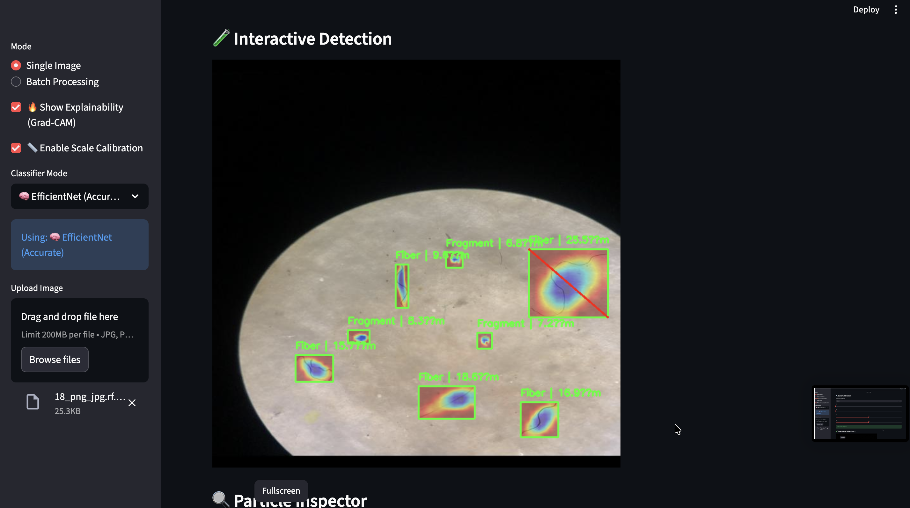
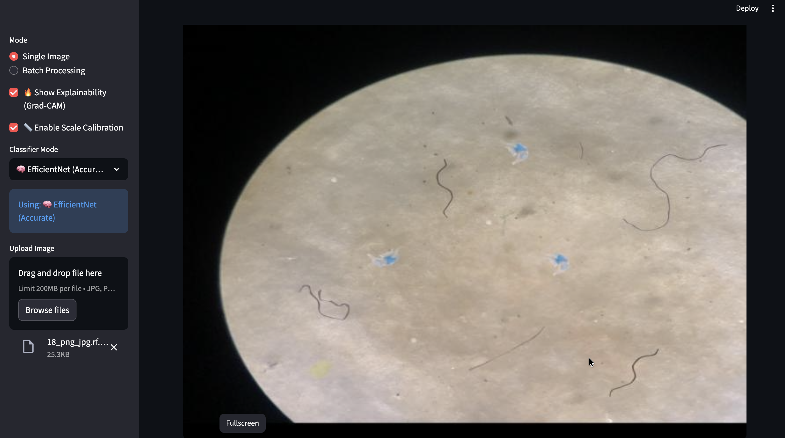
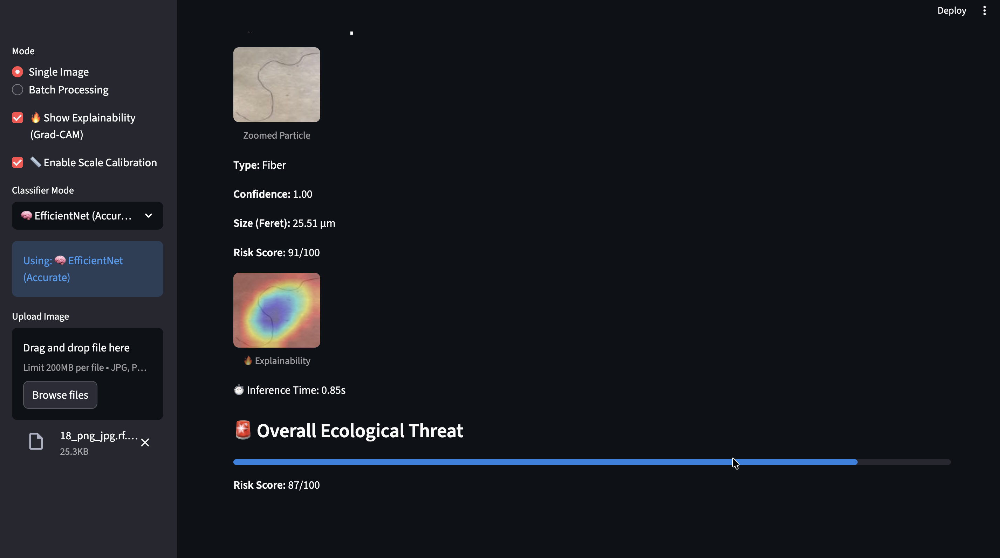

# Microplastic Risk Intelligence System

AI-powered system for detecting, classifying, measuring, and analyzing microplastics using computer vision and explainable AI.

# Problem Statement

Microplastics (<5mm) are found in oceans, rivers, and even drinking water.
Current identification methods are:

Expensive (lab-based)
Time-consuming
Not scalable

More importantly, morphology (shape) determines ecological damage:

Fiber → entangles organisms
Fragment → releases toxins
Film → smothers ecosystems

Video
https://drive.google.com/file/d/1rQYiVeZqyWsCcZhHVxZBCalMzca3g_2f/view

👉 There is no automated system to analyze morphology + size + risk at scale

🎯 Our Solution

We built a hybrid AI pipeline that:

Detects multiple microplastics in an image
Classifies morphology (Fiber / Fragment / Film / Pellet)
Computes Feret diameter (true longest dimension)
Converts to real-world size using scale calibration
Generates an Ecological Threat Index (0–100)
Provides interactive + explainable analysis

 Why Our Approach is Unique
Approach	Limitation
YOLO only	Detection without deep understanding
CNN only	Classification without localization
Our Hybrid Model	✅ Detection + Understanding + Measurement

We combine YOLO (detection) + CNN (classification) + Contour Geometry (measurement)

 Key Features

1. Multi-Particle Detection
Detects multiple microplastics in a single image
Uses YOLO for robust localization
🔬 Morphology Classification

Models:
EfficientNet (accurate)
MobileNet (fast)

Classes:

Fiber
Fragment
Film
Pellet (optional)

📏 Scientific Size Estimation
Uses Feret Diameter
Based on contour geometry
More accurate than bounding box

📐 Scale Calibration
Convert pixels → micrometers (µm)
User-defined reference scale
Enables real-world scientific measurement

🔥 Explainable AI (Grad-CAM)
Visual heatmaps showing decision regions
Improves trust and interpretability

🧪 Interactive Particle Inspector
Click on any particle
View:
Zoomed image
Class + confidence
Size (µm)
Risk score
Explanation heatmap

📊 Ecological Risk Index
Combines:
Morphology
Size
Outputs risk score (0–100)

📂 Batch Processing
Upload multiple images

Get:
Distribution of particle types
Average risk
Summary insights

📄 Report Generation
CSV download
PDF reports

